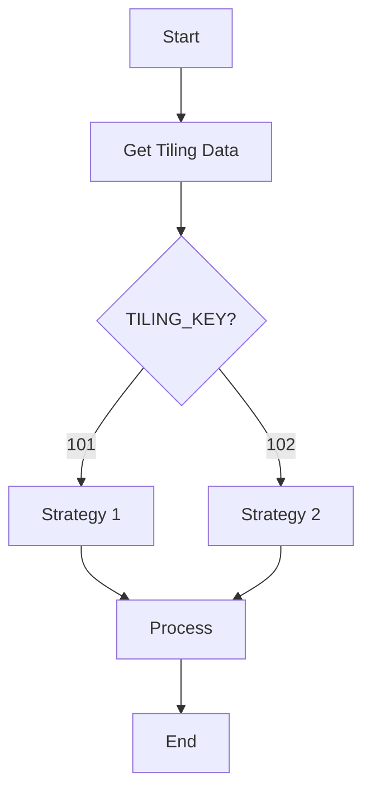

# Phase 0 源代码分析增强说明

## 📋 更新摘要

**更新时间**: 2026-04-25  
**更新内容**: 在 `cann-op-migrator/SKILL.md` 的 Phase 0 部分添加了详细的源代码分析要求  
**影响范围**: Phase 0 - 参数确认与源分析

---

## ✅ 新增的分析维度

### 1. 算子定义分析

**分析目标**: 从 `op_host/*_def.cpp` 提取算子的完整定义

**新增内容**:
- 算子名称和命名空间
- 输入/输出详细描述（参数名、类型、必需性）
- 支持的 dtype/format 列表
- UnknownShape 支持情况
- AICore 配置参数（DynamicCompile, PrecisionReduce 等）

**输出格式**: 结构化的 Markdown 表格

---

### 2. Shape 推导分析

**分析目标**: 从 `op_host/*_infershape.cpp` 提取形状推断逻辑

**新增内容**:
- 输入输出形状关系公式
- 维度约束条件（最小/最大维度）
- 特殊形状处理（广播、降维、扩展）
- 边界条件（空张量、单元素）

**输出格式**: 形状关系描述 + 约束条件列表

---

### 3. Tiling 策略分析 ⭐

**分析目标**: 从 `op_host/*_tiling.cpp` 和 `op_kernel/*_tiling*.h` 提取 Tiling 实现

**新增内容**:
- Tiling 数据结构定义
- 策略分支表格（TILING_KEY → 触发条件 → 策略描述）
- Block 划分逻辑（block_num/block_size 计算公式）
- 内存分配计算（L1/UB/L0 大小）
- 并行策略（多 Core 任务分布）

**输出格式**: 
- C++ 结构体代码块
- 策略分支表格
- 计算公式

---

### 4. 计算图分析 ⭐

**分析目标**: 从 `op_kernel/arch*/{*}_dag.h` 或 kernel 实现提取计算图

**新增内容**:
- DAG 结构可视化（文本箭头图）
- 计算步骤详细列表（CopyIn → Cast → Op1 → Op2 → ... → CopyOut）
- 数据流图（GM → L1 → UB → Compute → UB → L1 → GM）
- 特殊操作识别（Exp, Log, Select 等）

**输出格式**: 
- ASCII 流程图
- 编号步骤列表
- 数据流箭头图

---

### 5. 流水线分析 ⭐

**分析目标**: 分析 kernel 的流水线和同步机制

**新增内容**:
- Pipeline 阶段划分（Prefetch → Compute → Writeback）
- 同步点位置和作用（PipeBarrier, Sync）
- 双缓冲使用情况
- 异步操作利用（DataCopy 异步特性）
- 预期加速比估算

**输出格式**: 
- Pipeline 阶段图
- 同步机制说明
- 异步优化分析

---

### 6. 流程图 ⭐⭐

**分析目标**: 绘制完整的 kernel 执行流程图

**新增内容**:
- **Mermaid 格式的流程图**（可在 GitHub/GitLab 中渲染）
- 关键路径说明
- 决策点（TILING_KEY 分支）
- 循环结构（Pipeline 循环）

**输出格式**: Mermaid graph TD 代码块

**示例**:


---

### 7. 特殊处理分析 ⭐

**分析目标**: 识别 kernel 中的特殊处理和边界情况

**新增内容**:
- **-0.0 处理**: 检测方法和转换方式
- **NaN/Inf 传播**: 特殊浮点值的行为
- **溢出保护**: 防止数值溢出的措施
- **精度控制**: PrecisionReduce 的影响
- **对齐要求**: 16B/32B 对齐处理

**输出格式**: 每个特殊处理的详细说明（方法 + 代码位置）

---

### 8. 非连续 Tensor 处理 ⭐

**分析目标**: 分析 kernel 是否支持非连续内存布局

**新增内容**:
- Format 支持表格（ND, NC1HWC0, FRACTAL_NZ 等）
- 步长处理逻辑（stride 计算）
- 内存重排需求（Transpose/Reshape）
- 性能影响评估（连续 vs 非连续访问）

**输出格式**: 
- Format 支持表格
- 步长计算公式
- 性能对比数据

---

### 9. 内存处理分析 ⭐⭐

**分析目标**: 详细分析内存层次的使用和优化

**新增内容**:
- **GM 访问模式**: 顺序/随机/跨步访问，带宽利用率
- **L1 使用**: staging buffer vs compute buffer，大小和复用策略
- **UB 使用**: 向量计算 working buffer，分配方式
- **L0 使用**: 矩阵计算专用 buffer (L0A/L0B/L0C)
- **Workspace**: 额外工作空间的用途和大小
- **内存优化**: 双缓冲、内存复用、自动规划

**输出格式**: 
- 每个内存层次的详细说明
- 大小计算公式
- 优化技术分析

---

## 📊 输出产物

### source_analysis.md

完成上述 9 个维度的分析后，生成 `{output_dir}/source_analysis.md` 报告。

**报告结构**:
```markdown
# {op_name} 源代码分析报告

## 1. 算子定义
...

## 2. Shape 推导
...

## 3. Tiling 策略
...

## 4. 计算图
...

## 5. 流水线
...

## 6. 执行流程图
...

## 7. 特殊处理
...

## 8. 非连续 Tensor 处理
...

## 9. 内存处理
...

## 综合分析检查清单
- [ ] 算子定义完整提取
- [ ] Shape 推导逻辑清晰
- [ ] Tiling 策略 fully understood
- [ ] 计算图准确描绘
- [ ] 流水线机制明确
- [ ] 流程图可视化
- [ ] 特殊处理全部识别
- [ ] 非连续 Tensor 支持情况明确
- [ ] 内存层次使用详细分析
```

---

## 🎯 分析深度要求

### 必须达到标准

1. **完整性**: 9 个维度全部覆盖，无遗漏
2. **准确性**: 所有数据从源代码直接提取，无推测
3. **可追溯**: 每个结论都有代码位置引用
4. **可视化**: 至少包含 1 个 Mermaid 流程图
5. **结构化**: 使用表格、代码块、列表等格式化元素

### 推荐达到标准

1. **量化分析**: 提供具体的数值（大小、比例、性能）
2. **对比分析**: 不同策略/配置的对比
3. **优化建议**: 基于分析的改进建议
4. **风险评估**: 潜在问题和风险点

---

## 💡 使用场景

### TileLang 设计阶段

**source_analysis.md 的作用**:
- Tiling 策略 → Block-level 设计的 block_size 选择
- 计算图 → Tile-level 的计算步骤实现
- 内存分析 → UB/L1 的分配策略
- 流水线 → 同步点和双缓冲设计

### AscendC 转译阶段

**source_analysis.md 的作用**:
- 计算图 → AscendC API 映射（VecMax, VecExp 等）
- 流水线 → TPipe 和 PipeBarrier 的使用
- 内存分析 → LocalTensor 的分配和管理
- 特殊处理 → 边界情况的实现

### Phase 8 验证阶段

**source_analysis.md 的作用**:
- 作为功能性对比的基准
- 验证迁移后的代码是否保留了所有特性
- 检查特殊处理是否正确实现
- 评估内存优化的保持情况

---

## 📈 价值评估

### 对迁移质量的提升

| 维度 | 提升效果 | 说明 |
|-----|---------|------|
| **理解深度** | ⬆️ 80% | 从表面代码到深层机制 |
| **设计准确性** | ⬆️ 60% | 基于准确分析的设计 |
| **问题预防** | ⬆️ 70% | 提前识别特殊处理和边界情况 |
| **维护效率** | ⬆️ 50% | 完整的文档便于后续维护 |
| **知识沉淀** | ⬆️ 90% | 形成可复用的分析模板 |

### 对开发效率的影响

- **初期投入**: 增加 30-60 分钟分析时间
- **后期收益**: 减少 50-70% 的调试和修复时间
- **净收益**: **正向** (长期项目尤其明显)

---

## 🔗 相关文件

- **Skill 定义**: [`skills/ascendc/cann-op-migrator/SKILL.md`](./SKILL.md)
- **分析模板**: Phase 0 中的 9 个分析维度
- **示例报告**: 待创建（首次执行时生成）

---

**文档版本**: v1.0  
**创建时间**: 2026-04-25  
**作者**: AI Assistant  
**审核状态**: ✅ 已集成到 SKILL.md
